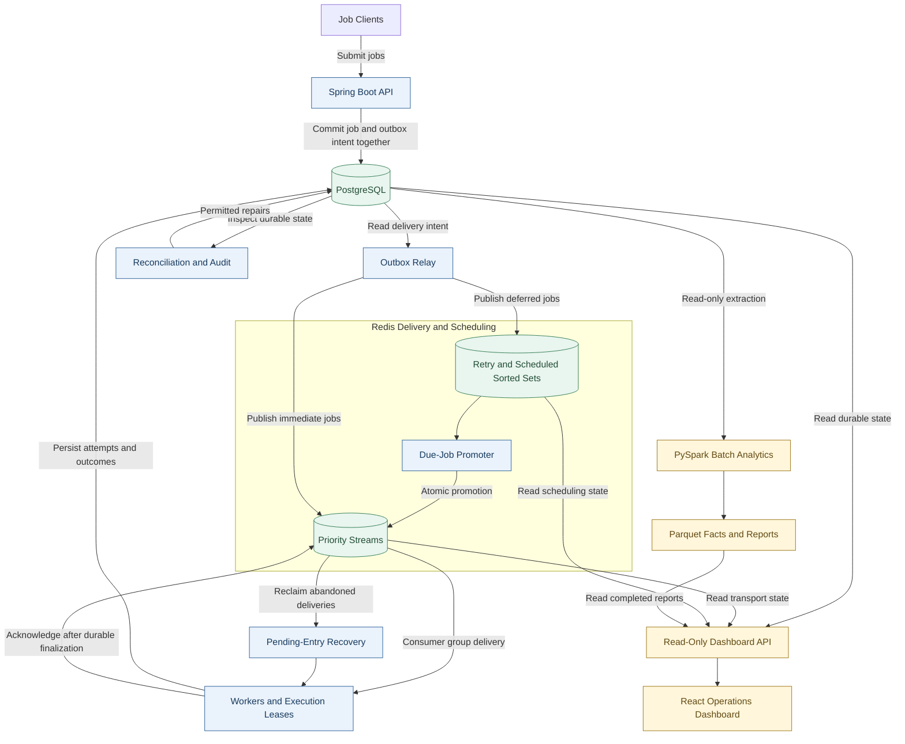

# DistroQ

**Durable jobs. Recoverable execution. Visible operations.**

[Overview](#overview) | [Capabilities](#capabilities) | [Architecture](#architecture) |
[Job Lifecycle](#job-lifecycle) | [Tech Stack](#tech-stack) | [Documentation](#documentation)

---

## Overview

DistroQ is a distributed background-job processing system built with Java and Spring Boot.
It handles the work behind a request: recording jobs, delivering them to workers, scheduling
future execution, retrying failures, and preserving the history needed to understand each outcome.

PostgreSQL stores job state and durable delivery intent. Redis Streams and sorted sets handle
transport, priorities, and scheduling. A transactional outbox connects these responsibilities,
while execution leases and consumer-group recovery support **at-least-once processing**.
Read-only operational views and a separate analytics pipeline make both current activity and
historical behavior inspectable.

> The design centers on a clear sequence: record the intent, deliver the work, persist the outcome,
> then acknowledge the delivery.

| Priority Tiers | Dashboard API | Analytics Facts | Quality Checks |
|:---:|:---:|:---:|:---:|
| **3** | **11 GET endpoints** | **7 datasets** | **20 checks** |
| HIGH, NORMAL, LOW | Read-only operational views | Parquet-backed history | Report-only validation |

## Capabilities

| Capability | What We Built | Why It Matters |
|---|---|---|
| **Durable submission** | Transactional outbox, submission idempotency, and Redis publication deduplication | Records job state and delivery intent together, with distinct handling for repeated requests and publication retries. |
| **Recoverable execution** | Redis Streams, consumer groups, execution leases, heartbeats, and pending-entry recovery | Tracks delivery and execution ownership so abandoned work can be picked up again. |
| **Retry and replay** | Exponential backoff with jitter, attempt history, dead-letter storage, and replay | Gives transient failures another opportunity while retaining a traceable history of exhausted jobs. |
| **Priority and scheduling** | Priority tiers, a process-local starvation guard, and separate retry and scheduled sorted sets | Routes work by urgency and due time without occupying workers while jobs wait. |
| **Reconciliation** | Bounded state inspection, permitted repairs, and reason-bearing audit records | Makes inconsistent durable state visible and records corrective actions. |
| **Cooperative effects** | A transactional effect ledger and an idempotent counter handler | Lets participating handlers coordinate an effect with its durable record across repeated execution. |

## Visibility and Analytics

### Operational Views

The React dashboard brings jobs, queues, workers, outbox publication, reconciliation, dead letters,
analytics, and runtime information into read-only views. Its polling retains the last successful
data and marks it stale when refreshes fail. Separate availability states distinguish missing or
unreachable data from a measured zero.

### Historical Reporting

A separate PySpark batch pipeline reads PostgreSQL through read-only JDBC connections and writes
Parquet facts over explicit UTC windows. It produces daily, job-type, priority, publication, and
reliability reports, with data-quality findings alongside the aggregates. Saved exports support
repeatable report calculations without querying the operational database again.

| Operational Question | Project Support |
|---|---|
| What is waiting, running, or failing? | Queue, worker, job, and dead-letter views |
| What happened to a particular job? | Durable job state, ordered attempts, and replay history |
| Where does delivery intent need attention? | Outbox lifecycle and reconciliation findings |
| How has behavior changed over time? | Historical facts, aggregate reports, and quality checks |

## Architecture

<!-- mermaid-checked: quoted labels, named subgraphs, balanced blocks, unique node ids -->

### Architectural Decisions

- **One durable authority:** PostgreSQL owns business state and delivery intent; Redis owns
  transport and scheduling state.
- **Explicit ownership:** Worker leases and conditional finalization govern database updates,
  while Streams retain unacknowledged deliveries for recovery.
- **Separate observers:** Dashboard reads and batch analytics remain separate from execution and
  audited administrative actions.

## Job Lifecycle

| Stage | What Happens |
|---|---|
| **1. Accept** | Validate the request and commit the job, optional submission key, and outbox intent together. |
| **2. Publish** | Relay durable intent to a priority stream or a retry/scheduled sorted set. |
| **3. Claim** | Deliver through a consumer group and acquire a database execution lease. |
| **4. Execute** | Run the handler, renew ownership through heartbeats, and record the attempt outcome. |
| **5. Settle** | Persist success, retry intent, or a dead-letter outcome before acknowledging the delivery. |
| **6. Inspect** | Follow job history, publication state, and reliability findings through operational views and reports. |

At-least-once execution makes recovery possible through redelivery. Submission keys, publication
markers, and cooperative effect records address duplication at their respective boundaries.

## Tech Stack

| Layer | Technologies | Responsibility |
|---|---|---|
| **Backend** | Java 21, Spring Boot, Spring MVC, Maven | APIs, execution workflows, and background services |
| **Persistence** | PostgreSQL, Spring Data JPA, Hibernate, Flyway | Durable state, transactions, querying, and schema evolution |
| **Delivery** | Redis Streams, Consumer Groups, Sorted Sets, Lettuce, Lua | Delivery tracking, scheduling, and atomic Redis-local promotion |
| **Frontend** | React 18, TypeScript, Vite | Read-only operational interface |
| **Analytics** | Python, PySpark, Parquet, PostgreSQL JDBC | Historical extraction, transformation, reporting, and quality checks |
| **Observability** | Actuator, Micrometer, Prometheus metrics, JSON logging | Health signals, measurements, and correlated operational events |
| **Testing** | JUnit, Mockito, AssertJ, pytest, Vitest, React Testing Library, k6 | Unit tests, component tests, and controlled workload tooling |
| **Operations** | Docker, Docker Compose, PowerShell, shell scripts | Containerized environments and backup/restore workflows |

## Operational Engineering

The implementation pairs job-processing features with the supporting work needed to operate them:

- Dependency-aware readiness, independent liveness, and ordered graceful shutdown.
- Startup configuration validation and administrative bearer-token support.
- Structured logs, correlation IDs, and bounded metric labels.
- Flyway-managed migrations with Hibernate schema validation.
- PostgreSQL and Redis backup/restore tooling with explicit restore safeguards.

## Documentation

| Guide | Read It For |
|---|---|
| [Operations](OPERATIONS.md) | Configuration, health, shutdown, and recovery procedures |
| [Security](SECURITY.md) | Authentication, credentials, and deployment trust boundaries |
| [Upgrade Guide](UPGRADE.md) | Schema and application upgrade procedures |
| [Engineering Notes](NOTES.md) | Design choices, discoveries, and trade-offs |
| [Changelog](CHANGELOG.md) | Version history and release status |
| [Analytics](analytics/README.md) | Export windows, datasets, reports, and pipeline operation |